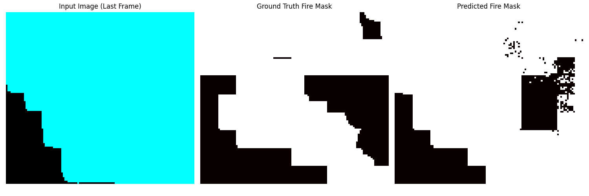

## 🔥 Wildfire Risk Segmentation & Forecasting with U-Net + ConvLSTM + Attention

This project develops a state-of-the-art wildfire prediction framework using a **custom U-Net + ConvLSTM** architecture with **attention**, trained on multimodal geospatial and environmental data across California and fire-prone U.S. states. Our system significantly improves wildfire detection accuracy and regional fire risk estimation.

---

### 📌 Project Highlights

* ✅ **Model**: U-Net + ConvLSTM with attention
* 🛰️ **Data**: Multimodal `.tif` layers (vegetation, wind, elevation, slope, etc.)
* 📈 **Performance**:

  * **F1 Score**: 0.9941
  * **Precision**: 0.9884
  * **Recall**: 1.0000
* ⚖️ **Loss Functions**: Dice, Focal, BCE
* 🌍 **Coverage**: California (2013–2024), extended to 10 more fire-prone U.S. states

---

### 🧠 Model Overview

| Component    | Description                                                                                        |
| ------------ | -------------------------------------------------------------------------------------------------- |
| **Baseline** | Replicated ULSTM from Stanford’s wildfire segmentation paper                                       |
| **Enhanced** | Integrated attention, multiple vegetation indices, data augmentation removal, and 3 loss functions |
| **Input**    | Daily `.tif` stacks (vegetation, wind, dewpoint, elevation, slope, fire masks)                     |
| **Output**   | Binary fire segmentation masks + probabilistic fire risk heatmaps                                  |

> 📊 Our final model surpassed both baseline and augmented models, with nearly perfect recall and minimal false positives.

---

### 🧪 Results & Evaluation

#### 🔬 California Model Results (2025):

* **Without Augmentation** (Final Model):

  * F1 Score: **0.9941**
  * Precision: 0.9884
  * Recall: **1.0000**
  * Confusion Matrix: \[TN: 5589 | FP: 664 | FN: 2 | TP: 56,465]

* **With Augmentation**:

  * F1 Score: 0.9834
  * Precision: 0.9674
  * Recall: 1.0000
  * Confusion Matrix: \[TN: 4350 | FP: 1903 | FN: 0 | TP: 56,467]

> ✅ Dropping data augmentation reduced false positives by **65%**, with **no loss in recall** — critical for early warning systems.

---

### 🌲 Sample Visualizations

* 🔥 Fire probability heatmaps
* 🧭 Confusion matrices and performance breakdowns
* 🌄 Multichannel input feature visualizations

---

### 📂 Repository Files

| File                                                              | Description                                                        |
| ----------------------------------------------------------------- | ------------------------------------------------------------------ |
|[Stanford Wildfire Segmentation Paper (Bhowmik et al., 2022)](https://arxiv.org/pdf/2208.09079)| Stanford reference paper by Rohan T. Bhowmik used as baseline                          |
[`Creating Non-Trivial Wildfire Prediction Models Final Paper.pdf`](./Creating%20Non-Trivial%20Wildfire%20Prediction%20Models%20Final%20Paper.pdf) | Final capstone report with model comparison, visuals, and findings |

---

### 📚 Data Sources

* 📡 **Google Earth Engine (GEE)** for `.tif` satellite and climate layers
* 🔥 **California Fire Datasets** from 2013–2024
* 🧭 Additional states: Oregon, Washington, Arizona, Colorado, Idaho, Montana, Nevada, New Mexico, Utah, Wyoming

---

### 💡 Key Insights

* Attention + spectral indices improved spatial detection
* Data augmentation introduced false positives and was removed
* FRP-weighted metrics proposed to improve detection realism
* U-Net + LSTM architecture is robust and generalizable

---

### 🚀 Future Work

* Expand multi-state validation (Oregon, WA, etc.)
* Incorporate FIRMS and NOAA for real-time streaming
* Add visual transformer (V-Net) for deeper spatial pattern learning
* Build risk classification head on top of segmentation outputs
* Create regional wildfire dashboards for public use

---
